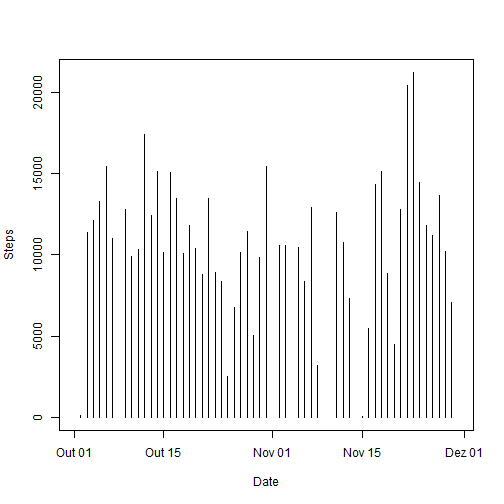
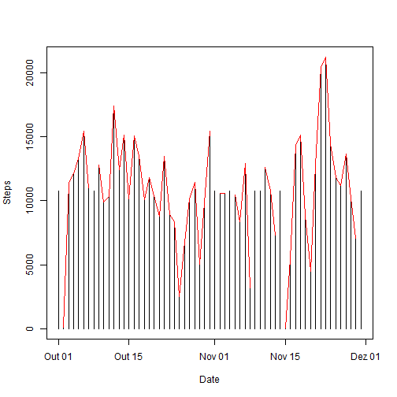
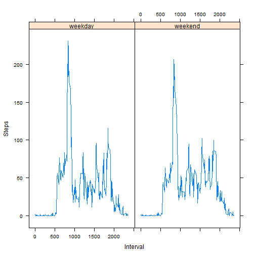

## Loading and preprocessing the data

1,2 - To load the data and process the date we can do the following:


```r
data <- read.csv(unz("activity.zip","activity.csv"), 
                 colClasses = c("numeric","Date","numeric"))


StepsperDay <- data.frame(date=as.Date(character()),steps=integer())
for (i in 1:length(unique(data$date))){
    cachedata <- subset(data, date==unique(data$date)[i])
    StepsperDay[i,1] <-unique(data$date)[i]
    StepsperDay[i,2] <-sum(cachedata$steps)
}

StepsperInterval <- data.frame(interval = integer(),steps=integer())
for (i in 1:length(unique(data$interval))){
    cachedata <- subset(data, interval==unique(data$interval)[i])
    StepsperInterval[i,1] <-unique(data$interval)[i]
    StepsperInterval[i,2] <-mean(cachedata$steps, na.rm=T)
}
```

## What is mean total number of steps taken per day?
1 - To get the mean total of steps taken per day we have to:


```r
plot(StepsperDay$date,StepsperDay$steps, type="h", xlab="Date", ylab="Steps")
```

 

```r
meanSteps <- as.character(round(mean(StepsperDay$steps,na.rm=T), digits = 0))
medianSteps <- as.character(round(median(StepsperDay$steps,na.rm=T), digits=0))
```

2 - So the average number of steps per day is 10766 , while the median number of steps per day is 10765.

## What is the average daily activity pattern?
1 - The average daily activity patter is this:


```r
plot(StepsperInterval$interval,StepsperInterval$steps, type="l",
     xlab="Interval", ylab="Steps")
```

 

```r
maxInterval <- StepsperInterval[order(-StepsperInterval$steps),]
maxInterval <- maxInterval[1,1]
```

2 - The 5 minute interval with the highest number of steps starts at 835
minutes.

## Imputing missing values
1 - To get the number of missing cases we can do this:


```r
sumNA <- sum(is.na(data))
```
So we have 2304 cases with missing observations.

2,3 - To deal with this issue we will substitute any missing observation with the average number of steps 
taken in that period.


```r
newData <- data
for (i in 1:length(data$steps)){
    if (is.na(data[i,1])== T){
        cachedata <- subset(StepsperInterval, interval == data[i,3])
        newData[i,1] <- cachedata[1,2]
    }
}

StepsperDayNA <- data.frame(date=as.Date(character()),steps=integer())
for (i in 1:length(unique(newData$date))){
    cachedata <- subset(newData, date==unique(newData$date)[i])
    StepsperDayNA[i,1] <-unique(newData$date)[i]
    StepsperDayNA[i,2] <-sum(cachedata$steps)
}
```

4 - With the new data without missing observations we can plot again the average number of steps taken each day.


```r
plot(StepsperDayNA$date,StepsperDayNA$steps, type="h", xlab="Date", ylab="Steps")
lines(StepsperDayNA$date,StepsperDay$steps, col="red")
```

 

```r
meanStepsNA <- as.character(round(mean(StepsperDayNA$steps,na.rm=T)))
medianStepsNA <- as.character(round(median(StepsperDayNA$steps,na.rm=T), digits=0))
```
In this dataset the average number of steps per day is 10766 , while the median number of steps per day is 10766. Which means there is no difference in the mean value, but there was a change in the median value from 10765 to 10766.

There is no signficant change in the data. This can be seen by the red line that represents the values before NA have been recalculated.

## Are there differences in activity patterns between weekdays and weekends?
1 - First we need to seperate weekdays from the weekend. We do the following:


```r
newData$weekday <- weekdays(newData$date, abbreviate = T)

for (i in 1:nrow(newData)){
    if (newData[i,4] == unique(newData$weekday)[6]|newData[i,4] == unique(newData$weekday)[7]){
        newData$weekend[i] <- "weekend"
    }
    else{
        newData$weekend[i] <- "weekday"
    }
}
```

2 - The we can calculate the average paces per interval in the weekdays and weekends. And plot them.


```r
StepsperIntervalWeekend <- data.frame(interval = integer(),steps=integer(),
                                      weekend=integer())
for (i in 1:length(unique(newData$interval))){
    cachedata <- subset(newData, interval==unique(newData$interval)[i])
    StepsperIntervalWeekend[i,1] <-unique(newData$interval)[i]
    StepsperIntervalWeekend[i,2] <-mean(cachedata$steps, na.rm=T)
    StepsperIntervalWeekend[i,3] <-"weekend"
}

StepsperIntervalWeekday <- data.frame(interval = integer(),steps=integer(),
                                      weekend=integer())
for (i in 1:length(unique(newData$interval))){
    cachedata <- subset(newData, interval==unique(newData$interval)[i] & weekend=="weekday")
    StepsperIntervalWeekday[i,1] <-unique(newData$interval)[i]
    StepsperIntervalWeekday[i,2] <-mean(cachedata$steps, na.rm=T)
    StepsperIntervalWeekday[i,3] <-"weekday"
}

StepsperIntervalWeekend <- rbind(StepsperIntervalWeekend,StepsperIntervalWeekday)

require(lattice)
weekendplot <- xyplot(steps~interval|factor(weekend), data=StepsperIntervalWeekend, type="l",
     xlab="Interval", ylab="Steps")

weekendplot
```

 


